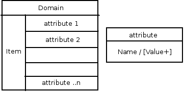

= Amazon SimpleDB Translator

The Amazon SimpleDB Translator, known by the type name _simpledb_, exposes querying functionality to https://docs.jboss.org/author/display/TEIID/Amazon+SimpleDB+Data+Sources[Amazon SimpleDB Data Sources].

NOTE: *"Amazon SimpleDB"* - Amazon SimpleDB is a web service for running queries on structured data in real time. This service works in close conjunction with Amazon Simple Storage Service (Amazon S3) and Amazon Elastic Compute Cloud (Amazon EC2), collectively providing the ability to store, process and query data sets in the cloud. These services are designed to make web-scale computing easier and more cost-effective for developers. Read more about it at http://aws.amazon.com/simpledb/

This translator provides an easy way connect to Amazon SimpleDB and provides relational way using SQL to add records from directly from user or from other sources that are integrated with Teiid. It also gives ability to read/update/delete existing records from SimpleDB store.

== Usage

Amazon SimpleDB is hosted key/value store where a single key can contain host multiple attribute name/value pairs where where value can also be a multi-value. The data structure can be represented by

Based on above data structure, when you import the metadata from SimpleDB into Teiid, the constructs are aligned as below

|===
|Simple DB Name |SQL (Teiid)

|Domain
|Table

|Item Name
|Column (ItemName) Primary Key

|attribute - single value
|Column - String Datatype

|attribute - multi value
|Column - String Array Datatype
|===

Since all attributes are by default are considered as string data types, columns are defined with string data type. However, during modeling of the schema in Designer, one can use various other data types supported through Teiid to define a data type of column, that user wishes to expose as.

NOTE: If you did modify data type be other than string based, be cautioned and do not use those columns in comparison queries, as SimpleDB does only lexicographical matching. To avoid it, set the "SearchType" on that column to "UnSearchable".

An Example Dynamic VDB that shows SimpleDB translator can be defined as

[source,xml]
----
<vdb name="myvdb" version="1">
    <model name="simpledb">
        <source name="node" translator-name="simpledb" connection-jndi-name="java:/simpledbDS"/>
    </model>
<vdb>
----

The translator does NOT provide a connection to the SimpleDB. For that purpose, Teiid has a JCA adapter that provides a connection to SimpleDB using Amazon SDK Java libraries. To define such connector, see Amazon SimpleDB Data Sources or see an example in "<jboss-as>/docs/teiid/datasources/simpledb"

If you are using Designer Tooling, to create VDB

Create/use a Teiid Designer Model project 

Use "Teiid Connection >> Source Model" importer, create SimpleDB Data Source using data source creation wizard and use _simpledb_ as translator in the importer. The table(s) is created in a source model by the time you finish with this importer, if the data is already defined on Amazon SimpleDB.

Create a VDB and deploy into Teiid Server and use either jdbc, odbc, odata etc to query.

== Properties

The Amazon SimpleDB Translator currently has no import or execution properties.

== Capabilities

The Amazon SimpleDB Translator supports SELECT statements with a restrictive set of capabilities including: comparison predicates, IN predicates, LIMIT and ORDER BY. Insert, update, delete are also supported.

*Queries on Attributes with Multiple Values*

Attributes with multiple values will defined as string array type. So this column is treated SQL Array type. The below table shows SimpleDB way of querying to Teiid way to query. The queries are based on http://docs.aws.amazon.com/AmazonSimpleDB/latest/DeveloperGuide/RangeValueQueriesSelect.html[http://docs.aws.amazon.com/AmazonSimpleDB/latest/DeveloperGuide/RangeValueQueriesSelect.html]

|===
|SimpleDB Query |Teiid Query

|select * from mydomain where Rating = '4 stars' or Rating = '****'
|select * from mydomain where Rating = ('4 stars','****')

|select * from mydomain where Keyword = 'Book' and Keyword = 'Hardcover'
|select * from mydomain where intersection(Keyword,'Book','Hardcover')

|select * from mydomain where every(Rating) = '****'
|select * from mydomain where every(Rating) = '****'
|===

With Insert/Update/Delete you write prepare statements or you can write SQL like

[source,sql]
----
INSERT INTO mydomain (ItemName, title, author, year, pages, keyword, rating) values ('0385333498', 'The Sirens of Titan', 'Kurt Vonnegut', ('1959'), ('Book', Paperback'), ('*****','5 stars','Excellent'))
----

== Direct Query Support

NOTE: This feature is turned off by default because of the security risk this exposes to execute any command against the source. To enable this feature, override the execution property called SupportsDirectQueryProcedure to true.

TIP: By default the name of the procedure that executes the queries directly is called native. Override the execution property DirectQueryProcedureName to change it to another name.

The SimpleDB translator provides a procedure to execute any ad-hoc simpledb query directly against the source without Teiid parsing or resolving. Since the metadata of this procedure’s results are not known to Teiid, they are returned as an object array. ARRAYTABLE can be used construct tabular output for consumption by client applications. Direct query supported for "select" based calls.

[source,sql]
----
SELECT X.* 
  FROM simpledb_source.native('SELECT firstname, lastname FROM users') n, ARRAYTABLE(n.tuple COLUMNS firstname string, lastname string) AS X
----

== JCA Resource Adapter

The Teiid specific Amazon SimpleDB Resource Adapter should be used with this translator. See https://docs.jboss.org/author/display/TEIID/Amazon+SimpleDB+Data+Sources[Amazon SimpleDB Data Sources] for connecting to SimpleDB.

