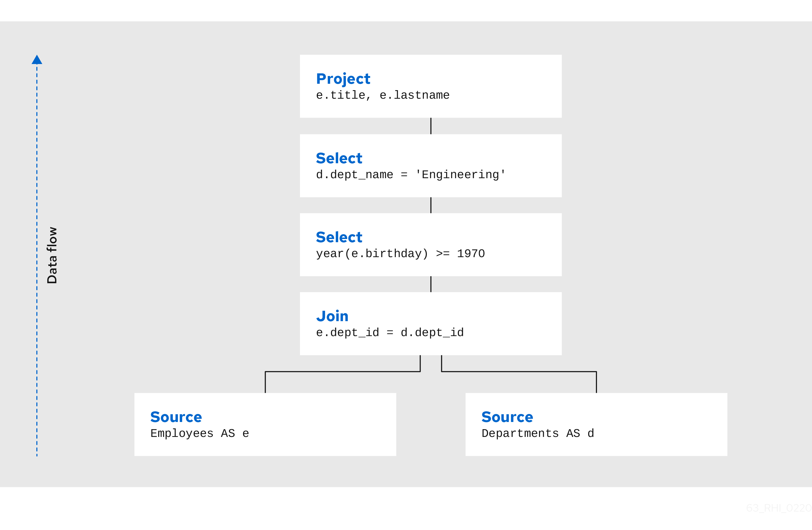

= Planning Overview

When the query engine receives an incoming SQL query it performs the following operations:

1.  *Parsing* - validate syntax and convert to internal form
2.  *Resolving* - link all identifiers to metadata and functions to the function library
3.  *Validating* - validate SQL semantics based on metadata references and type signatures
4.  *Rewriting* - rewrite SQL to simplify expressions and criteria
5.  *Logical plan optimization* - the rewritten canonical SQL is converted into a logical plan for in-depth optimization. The Teiid optimizer is predominantly rule-based. Based upon the query structure and hints a certain rule set will be applied. These rules may trigger in turn trigger the execution of more rules. Within several rules, Teiid also takes advantage of costing information. The logical plan optimization steps can be seen by using link:Planning_Overview.adoc#18646292_PlanningOverview-GettingaQueryPlan[SHOWPLAN DEBUG] clause and are described in the link:Query_Planner.adoc[Query Planner] section.
6.  *Processing plan conversion* - the logic plan is converted into an executable form where the nodes are representative of basic processing operations. The final processing plan is displayed as the link:Query_Plans.adoc[Query Plans].

The logical query plan is a tree of operations used to transform data in source tables to the expected result set. In the tree, data flows from the bottom (tables) to the top (output). The primary logical operations are _select_ (select or filter rows based on a criteria), _project_ (project or compute column values), _join_ , _source_ (retrieve data from a table), _sort_ (ORDER BY), _duplicate removal_ (SELECT DISTINCT), _group_ (GROUP BY), and _union_ (UNION).

For example, consider the following query that retrieves all engineering employees born since 1970.

[source,sql]
.*Example query*
----
SELECT e.title, e.lastname FROM Employees AS e JOIN Departments AS d ON e.dept_id = d.dept_id WHERE year(e.birthday) >= 1970 AND d.dept_name = 'Engineering'
----

Logically, the data from the Employees and Departments tables are retrieved, then joined, then filtered as specified, and finally the output columns are projected. The canonical query plan thus looks like this:

Data flows from the tables at the bottom upwards through the join, through the select, and finally through the project to produce the final results. The data passed between each node is logically a result set with columns and rows.

Of course, this is what happens _logically_ , not how the plan is actually executed. Starting from this initial plan, the query planner performs transformations on the query plan tree to produce an equivalent plan that retrieves the same results faster. Both a federated query planner and a relational database planner deal with the same concepts and many of the same plan transformations. In this example, the criteria on the Departments and Employees tables will be pushed down the tree to filter the results as early as possible.

In both cases, the goal is to retrieve the query results in the fastest possible time. However, the relational database planner does this primarily by optimizing the access paths in pulling data from storage.

In contrast, a federated query planner is less concerned about storage access because it is typically pushing that burden to the data source. The most important consideration for a federated query planner is minimizing data transfer.
