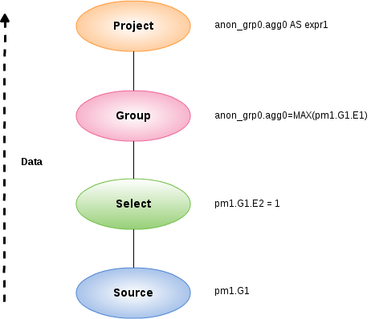

= Query Planner

* <<Canonical Plan and All Nodes, Canonical Plan and All Nodes>>
* <<Node Properties, Node Properties>>
** <<Access Properties, Access Properties>>
** <<Set operation Properties, Set operation Properties>>
** <<Join Properties, Join Properties>>
** <<Project Properties, Project Properties>>
** <<Select Properties, Select Properties>>
** <<Sort Properties, Sort Properties>>
** <<Source Properties, Source Properties>>
** <<Group Properties, Group Properties>>
** <<Tuple Limit Properties, Tuple Limit Properties>>
** <<General and Costing Properties, General and Costing Properties>>
* <<Rules, Rules>>

For each sub-command in the user command an appropriate kind of sub-planner is used (relational, XML, procedure, etc).

Each planner has three primary phases:

1.  Generate canonical plan
2.  Optimization
3.  Plan to process converter - converts plan data structure into a processing form

== Relational Planner

A relational processing plan is created by the optimizer after the logical plan is manipulated by a series of rules. The application of rules is determined both by the query structure and by the rules themselves. The node structure of the debug plan resembles that of the processing plan, but the node types more logically represent SQL operations.

=== Canonical Plan and All Nodes

As link:Planning_Overview.adoc[Planning Overview], a user SQL statement after Parsing, Resolving, Validating, Rewriting, it be converted into a canonical plan form. The canonical plan form most closely resembles the initial SQL structure. A SQL select query has the following possible clauses (all but SELECT are optional):  WITH, SELECT, FROM, WHERE, GROUP BY, HAVING, ORDER BY, LIMIT.  These clauses are logically executed in the following order:

1.  WITH (create common table expressions) - handled by a specialized PROJECT NODE
2.  FROM (read and join all data from tables) - SOURCE node for each from clause item, Join node (if >1 table)
3.  WHERE (filter rows) - SELECT node
4.  GROUP BY (group rows into collapsed rows) - GROUP node
5.  HAVING (filter grouped rows) - SELECT node
6.  SELECT (evaluate expressions and return only requested rows) - PROJECT node and DUP_REMOVE node (for SELECT DISTINCT)
7.  INTO - specialized PROJECT with a SOURCE child
8.  ORDER BY (sort rows) - SORT node
9.  LIMIT (limit result set to a certain range of results) - LIMIT node

For example, a SQL statement such as `SELECT max(pm1.g1.e1) FROM pm1.g1 WHERE e2 = 1` creates a logical plan:

[source,xml]
----
Project(groups=[anon_grp0], props={PROJECT_COLS=[anon_grp0.agg0 AS expr1]})
  Group(groups=[anon_grp0], props={SYMBOL_MAP={anon_grp0.agg0=MAX(pm1.G1.E1)}})
    Select(groups=[pm1.G1], props={SELECT_CRITERIA=pm1.G1.E2 = 1})
      Source(groups=[pm1.G1])
----

Here the Source corresponds to the FROM clause, the Select corresponds to the WHERE clause, the Group corresponds to the implied grouping to create the max aggregate, and the Project corresponds to the SELECT clause.

NOTE: The affect of grouping generates what is effectively an inline view, anon_grp0, to handle the projection of values created by the grouping.

.**Node Types**
|===
|Type Name | Description

|ACCESS
|a source access or plan execution.

|DUP_REMOVE 
|removes duplicate rows

|JOIN 
|a join (LEFT OUTER, FULL OUTER, INNER, CROSS, SEMI, etc.)

|PROJECT 
|a projection of tuple values

|SELECT 
|a filtering of tuples

|SORT 
|an ordering operation, which may be inserted to process other operations such as joins

|SOURCE 
|any logical source of tuples including an inline view, a source access, XMLTABLE, etc.

|GROUP 
|a grouping operation

|SET_OP 
|a set operation (UNION/INTERSECT/EXCEPT)

|NULL 
|a source of no tuples

|TUPLE_LIMIT 
|row offset / limit
|===

=== Node Properties

Each node has a set of applicable properties that are typically shown on the node.

==== Access Properties

.**Access Properties**
|===
|Property Name | Description

|ATOMIC_REQUEST 
|The final form of a source request

|MODEL_ID 
|The metadata object for the target model/schema

|PROCEDURE_CRITERIA/PROCEDURE_INPUTS/PROCEDURE_DEFAULTS 
|Used in planning procedureal relational queries

|IS_MULTI_SOURCE 
|set to true when the node represents a multi-source access

|SOURCE_NAME 
|used to track the multi-source source name

|CONFORMED_SOURCES 
|tracks the set of conformed sources when the conformed extension metadata is used

|SUB_PLAN/SUB_PLANS 
|used in multi-source planning
|===

==== Set operation Properties

.**Set operation Properties**
|===
|Property Name | Description

|SET_OPERATION/USE_ALL 
|defines the set operation(UNION/INTERSECT/EXCEPT) and if all rows or distinct rows are used.
|===

==== Join Properties

.**Join Properties**
|===
|Property Name | Description

|JOIN_CRITERIA 
|all join predicates

|JOIN_TYPE 
|type of join (INNER, LEFT OUTER, etc.)

|JOIN_STRATEGY 
|the algorithm to use (nested loop, merge, etc.)

|LEFT_EXPRESSIONS 
|the expressions in equi-join predicates that originate from the left side of the join

|RIGHT_EXPRESSIONS 
|the expressions in equi-join predicates that originate from the right side of the join

|DEPENDENT_VALUE_SOURCE 
|set if a dependent join is used

|NON_EQUI_JOIN_CRITERIA 
|non-equi join predicates

|SORT_LEFT 
|if the left side needs sorted for join processing

|SORT_RIGHT 
|if the right side needs sorted for join processing

|IS_OPTIONAL 
|if the join is optional

|IS_LEFT_DISTINCT 
|if the left side is distinct with respect to the equi join predicates

|IS_RIGHT_DISTINCT 
|if the right side is distinct with respect to the equi join predicates

|IS_SEMI_DEP 
|if the dependent join represents a semi-join

|PRESERVE 
|if the preserve hint is preserving the join order
|===

==== Project Properties

.**Project Properties**
|===
|Property Name | Description

|PROJECT_COLS 
|the expressions projected

|INTO_GROUP 
|the group targeted if this is a select into or insert with a query expression

|HAS_WINDOW_FUNCTIONS 
|true if window functions are used

|CONSTRAINT 
|the constraint that must be met if the values are being projected into a group

|UPSERT 
|If the insert is an upsert
|===

==== Select Properties

.**Select Properties**
|===
|Property Name | Description

|SELECT_CRITERIA 
|the filter

|IS_HAVING
|if the filter is applied after grouping

|IS_PHANTOM 
|true if the node is marked for removal, but temporarily left in the plan.

|IS_TEMPORARY 
|inferred criteria that may not be used in the final plan

|IS_COPIED 
|if the criteria has already been processed by rule copy criteria

|IS_PUSHED 
|if the criteria is pushed as far as possible

|IS_DEPENDENT_SET 
|if the criteria is the filter of a dependent join
|===

==== Sort Properties

.**Sort Properties**
|===
|Property Name | Description

|SORT_ORDER 
|the order by that defines the sort

|UNRELATED_SORT 
|if the ordering includes a value that is not being projected

|IS_DUP_REMOVAL 
|if the sort should also perform duplicate removal over the entire projection
|===

==== Source Properties

.**Source Properties**
|===
|Property Name | Description

|SYMBOL_MAP 
|the mapping from the columns above the source to the projected expressions. Also present on Group nodes

|PARTITION_INFO 
|the partitioning of the union branches

|VIRTUAL_COMMAND 
|if the source represents an view or inline view, the query that defined the view

|MAKE_DEP 
|hint information

|PROCESSOR_PLAN 
|the processor plan of a non-relational source(typically from the NESTED_COMMAND)

|NESTED_COMMAND 
|the non-relational command

|TABLE_FUNCTION 
|the table function (XMLTABLE, OBJECTTABLE, etc.) defining the source

|CORRELATED_REFERENCES 
|the correlated references for the nodes below the source

|MAKE_NOT_DEP 
|if make not dep is set

|INLINE_VIEW 
|If the source node represents an inline view

|NO_UNNEST 
|if the no_unnest hint is set

|MAKE_IND 
|if the make ind hint is set

|SOURCE_HINT 
|the source hint. See link:Federated_Optimizations.adoc[Federated Optimizations].

|ACCESS_PATTERNS 
|access patterns yet to be satisfied

|ACCESS_PATTERN_USED 
|satisfied access patterns

|REQUIRED_ACCESS_PATTERN_GROUPS 
|groups needed to satisfy the access patterns. Used in join planning.
|===

NOTE: Many source properties also become present on associated access nodes.

==== Group Properties

.**Group Properties**
|===
|Property Name | Description

|GROUP_COLS 
|the grouping columns

|ROLLUP 
|if the grouping includes a rollup
|===

==== Tuple Limit Properties

.**Tuple Limit Properties**
|===
|Property Name | Description

|MAX_TUPLE_LIMIT 
|expression that evaluates to the max number of tuples generated

|OFFSET_TUPLE_COUNT 
|Expression that evaluates to the tuple offset of the starting tuple

|IS_IMPLICIT_LIMIT 
|if the limit is created by the rewriter as part of a subquery optimization

|IS_NON_STRICT 
|if the unordered limit should not be enforced strictly
|===

==== General and Costing Properties

.**General and Costing Properties**
|===
|Property Name | Description

|OUTPUT_COLS 
|the output columns for the node. Is typically set after rule assign output elements.

|EST_SET_SIZE 
|represents the estimated set size this node would produce for a sibling node as the independent node in a dependent join scenario

|EST_DEP_CARDINALITY 
|value that represents the estimated cardinality (amount of rows) produced by this node as the dependent node in a dependent join scenario

|EST_DEP_JOIN_COST 
|value that represents the estimated cost of a dependent join (the join strategy for this could be Nested Loop or Merge)

|EST_JOIN_COST 
|value that represents the estimated cost of a merge join (the join strategy for this could be Nested Loop or Merge)

|EST_CARDINALITY 
|represents the estimated cardinality (amount of rows) produced by this node

|EST_COL_STATS 
|column statistics including number of null values, distinct value count, etc.

|EST_SELECTIVITY 
|represents the selectivity of a criteria node
|===

=== Rules

Relational optimization is based upon rule execution that evolves the initial plan into the execution plan.  There are a set of pre-defined rules that are dynamically assembled into a rule stack for every query. The rule stack is assembled based on the contents of the user’s query and the views/procedures accessed.  For example, if there are no view layers, then rule Merge Virtual, which merges view layers together, is not needed and will not be added to the stack.  This allows the rule stack to reflect the complexity of the query.

Logically the plan node data structure represents a tree of nodes where the source data comes up from the leaf nodes (typically Access nodes in the final plan), flows up through the tree and produces the user’s results out the top.  The nodes in the plan structure can have bidirectional links, dynamic properties, and allow any number of child nodes.  Processing plans in contrast typically have fixed properties.

Plan rule manipulate the plan tree, fire other rules, and drive the optimization process. Each rule is designed to perform a narrow set of tasks. Some rules can be run multiple times. Some rules require a specific set of precursors to run properly.

* Access Pattern Validation - ensures that all access patterns have been satisfied
* Apply Security - applies row and column level security
* Assign Output Symbol - this rule walks top down through every node and calculates the output columns for each node.  Columns that are not needed are dropped at every node, which is known as projection minimization.  This is done by keeping track of both the columns needed to feed the parent node and also keeping track of columns that are "created" at a certain node.
* Calculate Cost - adds costing information to the plan
* Choose Dependent - this rule looks at each join node and determines whether the join should be made dependent and in which direction.  Cardinality, the number of distinct values, and primary key information are used in several formulas to determine whether a dependent join is likely to be worthwhile.  The dependent join differs in performance ideally because a fewer number of values will be returned from the dependent side.  Also, we must consider the number of values passed from independent to dependent side.  If that set is larger than the max number of values in an IN criteria on the dependent side, then we must break the query into a set of queries and combine their results. Executing each query in the connector has some overhead and that is taken into account.  Without costing information a lot of common cases where the only criteria specified is on a non-unique (but strongly limiting) field are missed.  A join is eligible to be dependent if:
* there is at least one equi-join criterion, i.e. tablea.col = tableb.col
* the join is not a full outer join and the dependent side of the join is on the inner side of the join

The join will be made dependent if one of the following conditions, listed in precedence order, holds:

* There is an unsatisfied access pattern that can be satisfied with the dependent join criteria
* The potential dependent side of the join is marked with an option makedep
* (4.3.2) if costing was enabled, the estimated cost for the dependent join (5.0+ possibly in each direction in the case of inner joins) is computed and compared to not performing the dependent join.  If the costs were all determined (which requires all relevant table cardinality, column ndv, and possibly nnv values to be populated) the lowest is chosen.
* If key metadata information indicates that the potential dependent side is not "small" and the other side is "not small" or (5.0.1) the potential dependent side is the inner side of a left outer join.

Dependent join is the key optimization we use to efficiently process multi-source joins. Instead of reading all of source A and all of source B and joining them on A.x = B.x, we read all of A then build a set of A.x that are passed as a criteria when querying B.  In cases where A is small and B is large, this can drastically reduce the data retrieved from B, thus greatly speeding the overall query.

* Choose Join Strategy - choose the join strategy based upon the cost and attributes of the join.
* Clean Criteria - removes phantom criteria
* Collapse Source - takes all of the nodes below an access node and creates a SQL query representation
* Copy Criteria - this rule copies criteria over an equality criteria that is present in the criteria of a join.  Since the equality defines an equivalence, this is a valid way to create a new criteria that may limit results on the other side of the join (especially in the case of a multi-source join).
* Decompose Join - this rule performs a partition-wise join optimization on joins of link:Federated_Optimizations.adoc#_partitioned_union[Federated Optimizations#Partitioned Union]. The decision to decompose is based upon detecting that each side of the join is a partitioned union (note that non-ansi joins of more than 2 tables may cause the optimization to not detect the appropriate join). The rule currently only looks for situations where at most 1 partition matches from each side.
* Implement Join Strategy - adds necessary sort and other nodes to process the chosen join strategy
* Merge Criteria - combines select nodes
* Merge Virtual - removes view and inline view layers
* Place Access - places access nodes under source nodes. An access node represents the point at which everything below the access node gets pushed to the source or is a plan invocation.  Later rules focus on either pushing under the access or pulling the access node up the tree to move more work down to the sources.  This rule is also responsible for placing link:Federated_Optimizations.adoc#_access_patterns[Federated Optimizations#Access Patterns].
* Plan Joins - this rule attempts to find an optimal ordering of the joins performed in the plan, while ensuring that link:Federated_Optimizations.adoc#_access_patterns[Federated Optimizations#Access Patterns] dependencies are met.  This rule has three main steps.  First it must determine an ordering of joins that satisfy the access patterns present.  Second it will heuristically create joins that can be pushed to the source (if a set of joins are pushed to the source, we will not attempt to create an optimal ordering within that set.  More than likely it will be sent to the source in the non-ANSI multi-join syntax and will be optimized by the database). Third it will use costing information to determine the best left-linear ordering of joins performed in the processing engine.  This third step will do an exhaustive search for 7 or less join sources and is heuristically driven by join selectivity for 8 or more sources.
* Plan Outer Joins - reorders outer joins as permitted to improve push down.
* Plan Procedures - plans procedures that appear in procedural relational queries
* Plan Sorts - optimizations around sorting, such as combining sort operations or moving projection
* Plan Subqueries - New for Teiid 12.  Generalizes the subquery optimization that was performed in Merge Criteria to allow for the creation of join plans from subqueries in both projection and filtering.
* Plan Unions - reorders union children for more pushdown
* Plan Aggregates - performs aggregate decomposition over a join or union
* Push Limit - pushes the affect of a limit node further into the plan
* Push Non-Join Criteria - this rule will push predicates out of an on clause if it is not necessary for the correctness of the join.
* Push Select Criteria - push select nodes as far as possible through unions, joins, and views layers toward the access nodes.  In most cases movement down the tree is good as this will filter rows earlier in the plan.  We currently do not undo the decisions made by Push Select Criteria.  However in situations where criteria cannot be evaluated by the source, this can lead to sub optimal plans.
* Push Large IN - push IN predicates that are larger than directly supported by the translator to be processed as a dependent set.

One of the most important optimization related to pushing criteria, is how the criteria will be pushed through join.  Consider the following plan tree that represents a subtree of the plan for the query `select * from A inner join b on (A.x = B.x) where B.y = 3`

[source,sql]
----
    SELECT (B.y = 3)
           |
          JOIN - Inner Join on (A.x = B.x)
         /     \    
      SRC (A)   SRC (B)
----

NOTE: SELECT nodes represent criteria, and SRC stands for SOURCE.

It is always valid for inner join and cross joins to push (single source) criteria that are above the join, below the join.  This allows for criteria originating in the user query to eventually be present in source queries below the joins.  This result can be represented visually as:

[source,sql]
----
          
    JOIN - Inner Join on (A.x = B.x)
          /    \
         /   SELECT (B.y = 3)
        |        |
      SRC (A)   SRC (B)
----

The same optimization is valid for criteria specified against the outer side of an outer join.  For example:

[source,sql]
----
     SELECT (B.y = 3) 
           |
          JOIN - Right Outer Join on (A.x = B.x)
         /     \    
      SRC (A)   SRC (B)
----

Becomes

[source,sql]
----
          JOIN - Right Outer Join on (A.x = B.x)
          /    \
         /   SELECT (B.y = 3)
        |        |
      SRC (A)   SRC (B)
----

However criteria specified against the inner side of an outer join needs special consideration.  The above scenario with a left or full outer join is not the same.  For example:

[source,sql]
----
      SELECT (B.y = 3)
           |
          JOIN - Left Outer Join on (A.x = B.x)
         /     \    
      SRC (A)   SRC (B)
----

Can become (available only after 5.0.2):

[source,sql]
----
    JOIN - Inner Join on (A.x = B.x)
          /    \
         /   SELECT (B.y = 3)
        |        |
      SRC (A)   SRC (B)
----

Since the criterion is not dependent upon the null values that may be populated from the inner side of the join, the criterion is eligible to be pushed below the join – but only if the join type is also changed to an inner join.  On the other hand, criteria that are dependent upon the presence of null values CANNOT be moved.  For example:

[source,sql]
----
    SELECT (B.y is null)
           |
          JOIN - Left Outer Join on (A.x = B.x)
         /     \   
      SRC (A)   SRC (B)
----

This plan tree must have the criteria remain above the join, since the outer join may be introducing null values itself.

* Raise Access - this rule attempts to raise the Access nodes as far up the plan as possible.  This is mostly done by looking at the source’s capabilities and determining whether the operations can be achieved in the source or not.
* Raise Null - raises null nodes. Raising a null node removes the need to consider any part of the old plan that was below the null node.
* Remove Optional Joins - removes joins that are marked as or determined to be optional
* Substitute Expressions - used only when a function based index is present
* Validate Where All - ensures criteria is used when required by the source

=== Cost Calculations

The cost of node operations is primarily determined by an estimate of the number of rows (also referred to as cardinality) that will be processed by it. The optimizer will typically compute cardinalities from the bottom up of the plan (or subplan) at several points in time with planning - once generally with rule calculate cost, and then specifically for join planning and other decisions. The cost calculation is mainly directed by the statistics set on physical tables(cardinality, NNV, NDV, etc.) and is also influenced by the presence of constraints (unique, primary key, index, etc.). If there is a situation that seems like a sub-optimal plan is being chosen, you should first ensure that at least representative table cardinalities are set on the physical tables involved.

=== Reading a Debug Plan

As each relational sub plan is optimized, the plan will show what is being optimized and it’s canonical form:

[source,sql]
----
OPTIMIZE: 
SELECT e1 FROM (SELECT e1 FROM pm1.g1) AS x

----------------------------------------------------------------------------
GENERATE CANONICAL: 
SELECT e1 FROM (SELECT e1 FROM pm1.g1) AS x

CANONICAL PLAN: 
Project(groups=[x], props={PROJECT_COLS=[e1]})
  Source(groups=[x], props={NESTED_COMMAND=SELECT e1 FROM pm1.g1, SYMBOL_MAP={x.e1=e1}})
    Project(groups=[pm1.g1], props={PROJECT_COLS=[e1]})
      Source(groups=[pm1.g1])
----

With more complicated user queries, such as a procedure invocation or one containing subqueries, the sub plans may be nested within the overall plan. Each plan ends by showing the final processing plan:

[source,sql]
----
----------------------------------------------------------------------------
OPTIMIZATION COMPLETE:
PROCESSOR PLAN:
AccessNode(0) output=[e1] SELECT g_0.e1 FROM pm1.g1 AS g_0
----

The affect of rules can be seen by the state of the plan tree before and after the rule fires. For example, the debug log below shows the application of rule merge virtual, which will remove the "x" inline view layer:

[source,sql]
----
EXECUTING AssignOutputElements

AFTER: 
Project(groups=[x], props={PROJECT_COLS=[e1], OUTPUT_COLS=[e1]})
  Source(groups=[x], props={NESTED_COMMAND=SELECT e1 FROM pm1.g1, SYMBOL_MAP={x.e1=e1}, OUTPUT_COLS=[e1]})
    Project(groups=[pm1.g1], props={PROJECT_COLS=[e1], OUTPUT_COLS=[e1]})
      Access(groups=[pm1.g1], props={SOURCE_HINT=null, MODEL_ID=Schema name=pm1, nameInSource=null, uuid=3335, OUTPUT_COLS=[e1]})
        Source(groups=[pm1.g1], props={OUTPUT_COLS=[e1]})

============================================================================
EXECUTING MergeVirtual

AFTER: 
Project(groups=[pm1.g1], props={PROJECT_COLS=[e1], OUTPUT_COLS=[e1]})
  Access(groups=[pm1.g1], props={SOURCE_HINT=null, MODEL_ID=Schema name=pm1, nameInSource=null, uuid=3335, OUTPUT_COLS=[e1]})
    Source(groups=[pm1.g1])
----

Some important planning decisions are shown in the plan as they occur as an annotation. For example the snippet below shows that the access node could not be raised as the parent select node contained an unsupported subquery.

[source,sql]
----
Project(groups=[pm1.g1], props={PROJECT_COLS=[e1], OUTPUT_COLS=null})
  Select(groups=[pm1.g1], props={SELECT_CRITERIA=e1 IN /*+ NO_UNNEST */ (SELECT e1 FROM pm2.g1), OUTPUT_COLS=null})
    Access(groups=[pm1.g1], props={SOURCE_HINT=null, MODEL_ID=Schema name=pm1, nameInSource=null, uuid=3341, OUTPUT_COLS=null})
      Source(groups=[pm1.g1], props={OUTPUT_COLS=null})

============================================================================
EXECUTING RaiseAccess
LOW Relational Planner SubqueryIn is not supported by source pm1 - e1 IN /*+ NO_UNNEST */ (SELECT e1 FROM pm2.g1) was not pushed

AFTER: 
Project(groups=[pm1.g1])
  Select(groups=[pm1.g1], props={SELECT_CRITERIA=e1 IN /*+ NO_UNNEST */ (SELECT e1 FROM pm2.g1), OUTPUT_COLS=null})
    Access(groups=[pm1.g1], props={SOURCE_HINT=null, MODEL_ID=Schema name=pm1, nameInSource=null, uuid=3341, OUTPUT_COLS=null})
      Source(groups=[pm1.g1])
----

=== Procedure Planner

The procedure planner is fairly simple.  It converts the statements in the procedure into instructions in a program that will be run during processing.  This is mostly a 1-to-1 mapping and very little optimization is performed.

=== XQuery

XQuery is eligible for specific link:XQuery_Optimization.adoc[optimizations]. Document projection is the most common optimization. It will be shown in the debug plan as an annotation. For example with the user query containing "xmltable('/a/b' passing doc columns x string path '@x', val string path '.')", the debug plan would show a tree of the document that will effectively be used by the context and path XQuerys:

[source,sql]
----
MEDIUM XQuery Planning Projection conditions met for /a/b - Document projection will be used
child element(Q{}a)
  child element(Q{}b)
    attribute attribute(Q{}x)
      child text()
    child text()
----

