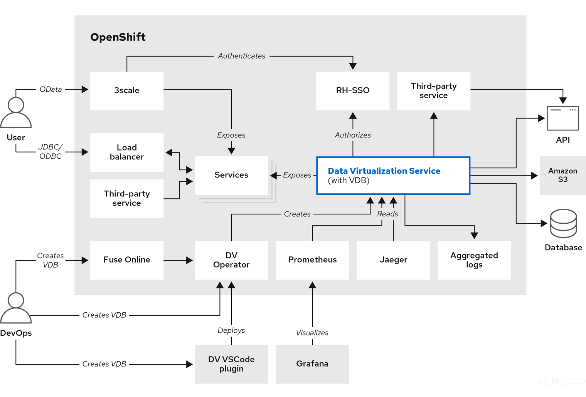
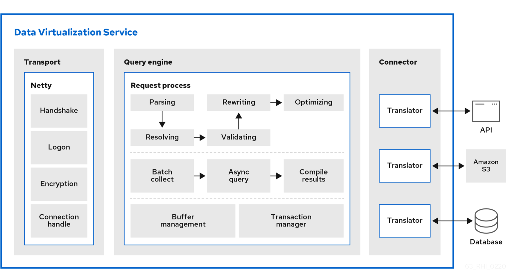

// Assembly included in the following assemblies:
//master.adoc
[id="architecture"]
= {{ book.productnameFull }} Architecture


.{{ book.productnameFull }} Components

image:images/teiid-components.png[images/teiid-components.png]

* **Designer Plugin** - Deprecated Eclipse Plugin based {{ book.productnameFull }} design environment, 
used to connect/federate/transform datasources to produce a `.vdb` file.
* **JVM** - {{ book.productnameFull }} is a pure Java Data Virtualization Platform.
* **{{ book.asName }}** - {{ book.productnameFull }} use a plugable installation which need a {{ book.asName }} Server installed, alternatively, a full installed {{ book.asName }} kit be distributed.
* **Subsystem** - Due to {{ book.asName }}'s Modular and Pluggable Architecture(a series of Management commands compose of a subsystem, a series of subsystems compose of the whole server), {{ book.productnameFull }} implement {{ book.asName }}'s Controller/Management API developed a `teiid` subsystem and reuse lots of other subsystems like `resource-adapter`, `infinispan`, `security`, `logging`, `datasource`.
* **odata.war** - {{ book.productnameFull }} support OData via odata.war. For more information, see _OData support_ in the xref:../client-dev/OData_Support.adoc[Client Developer's Guide]. 
* **dashboard.war** - A web based dashboard generator.
* **teiid-console** - A web based administrative and monitoring tool for Teiid, more details refer to link:../admin/Teiid_Console.adoc[Teiid Console]
* **JDBC Driver** - JDBC Driver to connect to Teiid Server.
* **AdminAPI** - An API for performing management and monitoring:../dev/AdminAPI.adoc[AdminAPI]
* **quickstarts** - A maven quickstart showing how to utilize {{ book.productnameFull }}.



image:images/teiid-architecture.png[images/teiid-architecture.png]






* Client:: link:../client-dev/Client_Developers_Guide.adoc[Client Developer's Guide]
Transport:: Transport services manage client connections: security authentication, encryption, and so forth.
Query Engine:: The query engine has several layers and components. At a high level, request processing is structured as follows:


The following diagram shows the components that make up the data virtualization service in greater detail:



1. SQL is converted to a processor plan. The engine receives an incoming SQL query. 
It is parsed to a internal command. Then the command is converted a logical plan via resolving, validating, and rewriting. 
Finally, rule and cost-based optimization convert the logical plan to a final processor plan. 
For more information, see xref:federated-planning[Federated planning].
2. Batch processing. The source and other aspects of query processing may return results 
asynchronously to the processing thread. As soon as possible, batches of results are made available to the client. 
3. Buffer management controls the bulk of the on and off heap memory that {{ book.productnameFull }} is using. 
It prevents consuming too much memory that otherwise might exceed the VM size.
4. Transaction management determines when transactions are needed and interacts with 
the TransactionManager subsystem to coordinate XA transactions.
+
Source queries are handled by the data tier layer which interfaces with the query engine and the 
connector layer which utilizes a translator to interact directly with a source. 
Connectivity is provided for heterogeneous data stores, such as databases or data warehouses, 
NoSQL, Hadoop, data grid/cache, files, SaaS, and so on.

Translator:: {{ book.productnameFull }} has developed a series of translators. For more information, see xref:translators[Translators]. 

Resource adapter:: Provides container managed access to a source. For more information, 
see _Developing JEE connectors_ in the link:../dev/Developing_JEE_Connectors.adoc[Developer's Guide].
  


include::r_terminology.adoc[leveloffset=+1]
include::r_data-management.adoc[leveloffset=+1]
include::r_query-termination.adoc[leveloffset=+1]
include::r_processing.adoc[leveloffset=+1]

