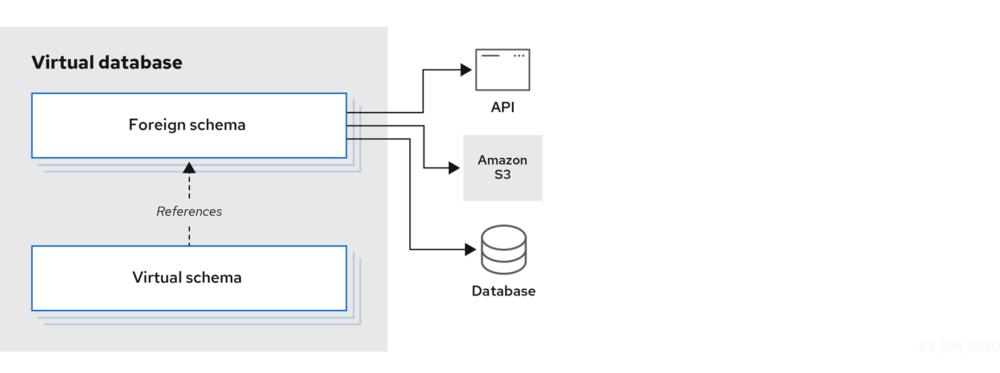

// Assembly included in master.adoc
[id="virtual-databases"]
= Virtual databases

A virtual database (VDB) is a metadata container for components used to integrate data from multiple data sources, 
so that they can be accessed in an integrated manner through a single, uniform API. 

A virtual database typically contains multiple schema components (also called as models), and each schema contains 
the metadata (tables, procedures, functions). 
There are two different types of schemas:  
 
Foreign schema:: Also called a _source_ or _physical_ schema, a foreign schema represents external or remote data sources, 
such as a relational database, such as Oracle, Db2, or MySQL; files, such as CSV or Microsoft Excel; or web services, such as SOAP or REST.

Virtual schema:: A view layer, or logical schema layer that is defined using schema objects from _foreign schemas_. 
For example, when you create a view table that aggregates multiple foreign tables from different sources, 
the resulting view shields users from the complexities of the data sources that define the view.

One important thing to note is, a virtual database contains only metadata. 
Any use case involving {{ book.productnameFull }} must have a virtual database model to begin with. 
So, it is important to learn how to design and develop a VDB.

The following example of a virtual database model, defines a single foreign schema component that makes a connection to a PostgreSQL database.

The SQL DDL commands in the example implement the SQL/MED specification.

[source,sql]
----
CREATE DATABASE my_example;
USE DATABASE my_example; 
CREATE SERVER pgsql 
    VERSION 'one' FOREIGN DATA WRAPPER postgresql 
    OPTIONS (
        "resource-name" 'java:/postgres-ds'
    );
CREATE SCHEMA test SERVER pgsql;
IMPORT FOREIGN SCHEMA public FROM SERVER pgsql INTO test 
    OPTIONS(
        importer.useFullSchemaName false, 
        importer.tableTypes 'TABLE,VIEW'
);
----


Or as an XML vdb:
[source,xml]
----
<vdb name="my-example" version="1">
    <model name="test" type="PHYSICAL">
        <property name="importer.schemaName" value="public"/>
        <property name="importer.useFullSchemaName" value="false"/>
        <property name="importer.tableTypes" value="TABLE,VIEW"/>         
        <source name="pqsql" translator-name="postgresql" connection-jndi-name="java:/postgres-ds"/>           
    </model>
</vdb>
----
Both formats define the same VDB.


The following sections describe in greater detail how the statements in the preceding example are used to define a virtual database. 
Before that we need to learn about the different elements of the _source schema_ component. 

.External data sources 
As shown in preceding example, the "source schema" component of a virtual database is a collection of schema objects, 
tables, procedures and functions, that represent an external data source's metadata locally. 
In the example, schema objects are not defined directly, but are imported from the server.  
Details of the connection to the external data source are provided through a `resource-name`, which is a named connection reference to a external data source.   

For the purposes of {{ book.productnameFull }}, connecting and issuing queries to fetch the metadata 
from these external data sources, {{ book.productnameFull }} defines/provides two types of resources.


.Resource adapter
A resource adapter (also called as SERVER) is connection object to the external data source. 
In the case of relational database this can be achieved through a JDBC connection, or in the case 
of a File this may be a reference to file's location. 
The resource-adapter provides a unified interface to define a connection in the {{ book.productnameFull }}. 
A resource adapter also provides way to natively issue commands and gather results. 
{{ book.productnameFull }} provides variety of resource adaptors to many different systems or one can be developed for new/custom data source. 
A resource adapters connection is represented above as the "resource-name".

As VDB developer you need to know, how to configure these sources in the {{ book.productnameFull }}. 
In {{ book.asName }} Server these are defined as JCA components. 
In {{ book.productnameFull }} embedded, the developer has to define the connections to these sources programmatically.  
Check out link:../admin/Administrators_Guide.adoc[Administrator's Guide] on how to configure 
these in {{ book.asName }}, or embedded examples, if you are working with {{ book.productnameFull }} Embedded.


.Translator  
A translator, also known as a `DATA WRAPPER`, is a component that provides an abstraction layer between the {{ book.productnameFull }} query engine 
and a physical data source. 
The translator knows how to convert query commands from {{ book.productnameFull }} into source-specific commands and execute them. 
The translator also has the intelligence to convert data that the physical source returns into a form that 
the {{ book.productnameFull }} query engine can process. 
For example, when working with a web service translator, the translator converts SQL procedures from the {{ book.productnameFull }} 
layer into HTTP calls, and JSON responses are converted to tabular results.

{{ book.productnameFull }} provides various translators as part of the system, or one can be developed by using the provided java libraries. 
For information about the available translators, see xref:translators[Translators].


IMPORTANT: In a VDB, a source schema *must be* configured with a *correct* Translator and a *valid* resource adapter, to make the system work.



include::r_vdb-properties.adoc[leveloffset=+1]
include::r_ddl-metadata-for-schema-objects.adoc[leveloffset=+1]
include::r_ddl-metadata-for-domains.adoc[leveloffset=+1]

