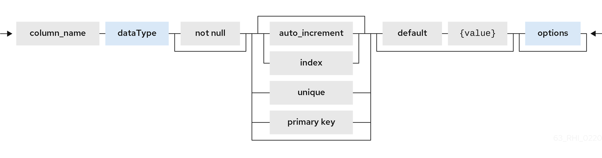
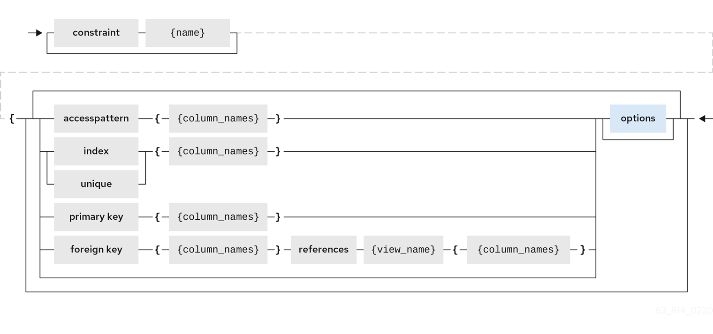
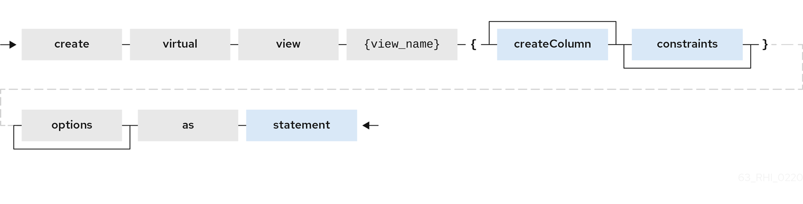
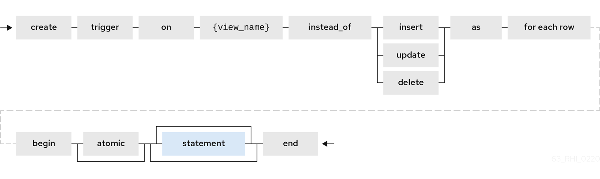
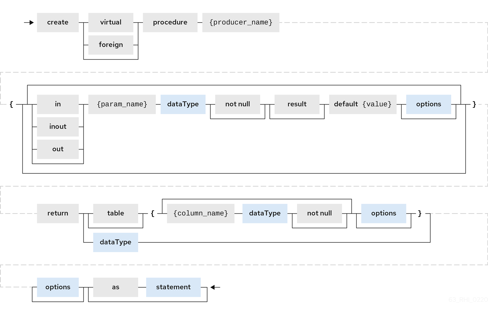

// Module included in the following assemblies:
// as_virtual-databases.adoc
[id="ddl-metadata-for-schema-objects"]
= DDL metadata for schema objects
:toc: manual
:toc-placement: preamble


The DDL for schema objects is common to both link:r_xml-deployment-mode.adoc[XML] and link:r_ddl-deployment-mode.adoc[DDL] VDBs.


Tables and views exist in the same namespace in a schema. Indexes are not considered schema scoped objects, 
but are rather scoped to the table or view they are defined against. Procedures and functions are defined in separate namespaces, 
but a function that is defined by virtual procedure language exists as both a function and a procedure of the same name. 
Domain types are not schema-scoped; they are scoped to the entire VDB. 

.Data types

For information about data types, see _simple data type_ in the xref:bnf-for-sql-grammar[BNF for SQL grammar].

.Foreign tables
A _FOREIGN_ table is table that is defined on source schema that represents a real relational table in 
source databases such as Oracle, Microsoft SQL Server, and so forth. For relational databases, {{ book.productnameFull }} 
can automatically retrieve the database schema information upon the deployment of the VDB, if you want to auto import the existing schema. 
However, users can use the following FOREIGN table semantics, when they would like to explicitly define tables on PHYSICAL schema 
or represent non-relational data as relational in custom translators.

.Example: Create foreign table (Created on PHYSICAL model)
[source,sql]
----
CREATE FOREIGN TABLE {table-name} (
    <table-element> (,<table-element>)*
    (,<constraint>)* 
) [OPTIONS (<options-clause>)]

<table-element> ::=
    {column-name} <data-type> <element-attr> <options-clause>

<data-type> ::=
    varchar | boolean | integer | double | date | timestamp .. (see Data Types)

<element-attr> ::=
    [AUTO_INCREMENT] [NOT NULL] [PRIMARY KEY] [UNIQUE] [INDEX] [DEFAULT {expr}]

<constraint> ::=
    CONSTRAINT {constraint-name} (
        PRIMARY KEY <columns> | 
        FOREIGN KEY (<columns>) REFERENCES tbl (<columns>)
        UNIQUE <columns> |
        ACCESSPATTERN <columns>
        INDEX <columns>

<columns> ::=
    ( {column-name} [,{column-name}]* )  
          
<options-clause> ::= 
    <key> <value>[,<key>, <value>]*
----

For more information about creating foreign tables, see _CREATE TABLE_ in xref:bnf-for-sql-grammar[BNF for SQL grammar]. 

Example: Create foreign table (Created on PHYSICAL model)
[source,sql]
----
CREATE FOREIGN TABLE Customer (
    id integer PRIMARY KEY, 
    firstname varchar(25), 
    lastname varchar(25),  
    dob timestamp);

CREATE FOREIGN TABLE Order (
    id integer PRIMARY KEY, 
    customerid integer OPTIONS(ANNOTATION 'Customer primary key'), 
    saledate date, 
    amount decimal(25,4), 
    CONSTRAINT CUSTOMER_FK FOREIGN KEY(customerid) REFERENCES Customer(id)
 ) OPTIONS(UPDATABLE true, ANNOTATION 'Orders Table');
----

*TABLE OPTIONS*: (the following options are well known, any others properties defined will be considered as extension metadata)

|===
|Property |Data type or allowed values |Description

|UUID
|string
|Unique identifier for the view.

|CARDINALITY
|int
|Costing information. Number of rows in the table. Used for planning purposes.

|UPDATABLE
|'TRUE'|'FALSE'
|Defines whether or not the view is allowed to update.

|ANNOTATION
|string
|Description of the view.

|DETERMINISM
|NONDETERMINISTIC, COMMAND_DETERMINISTIC, SESSION_DETERMINISTIC, USER_DETERMINISTIC, VDB_DETERMINISTIC, DETERMINISTIC
|Only checked on source tables.
|===

*COLUMN OPTIONS*: (the following options are well known, any others properties defined will be considered as extension metadata).

|===
|Property |Data type or allowed values |Description

|UUID
|string
|A unique identifier for the column.

|NAMEINSOURCE
|string
|If this is a column name on the FOREIGN table, this value represents name of the column in source database. 
If omitted, the column name is used when querying for data against the source.

|CASE_SENSITIVE
|'TRUE'\|'FALSE'
|
 
|SELECTABLE
|'TRUE'\|'FALSE'
|TRUE when this column is available for selection from the user query.

|UPDATABLE
|'TRUE'\|'FALSE'
|Defines if the column is updatable. Defaults to true if the view/table is updatable.

|SIGNED
|'TRUE'\|'FALSE'
|
 
|CURRENCY
|'TRUE'\|'FALSE'
|
 
|FIXED_LENGTH
|'TRUE'\|'FALSE'
|
 
|SEARCHABLE
|'SEARCHABLE'\|'UNSEARCHABLE'\|'LIKE_ONLY'\|'ALL_EXCEPT_LIKE'
|Column searchability. Usually dictated by the data type.

|MIN_VALUE
|
| 

|MAX_VALUE
|
| 

|CHAR_OCTET_LENGTH
|integer
|
 
|ANNOTATION
|string
|
 
|NATIVE_TYPE
|string
|
 
|RADIX
|integer
|
 
|NULL_VALUE_COUNT
|long
|Costing information. Number of NULLS in this column.

|DISTINCT_VALUES
|long
|Costing information. Number of distinct values in this column.
|===

Columns may also be marked as NOT NULL, auto_increment, or with a DEFAULT value.

A column of type bigdecimal/decimal/numeric can be declared without a precision/scale, 
which defaults to an internal maximum for precision with half scale, or with a precision which will default to a scale of 0.

A column of type timestamp can be declared without a scale which will default to an internal maximum of 9 fractional seconds.  

.Table Constraints

Constraints can be defined on table/view to define indexes and relationships to other tables/views. 
This information is used by the {{ book.productnameFull }} optimizer to plan queries, 
or use the indexes in materialization tables to optimize the access to the data.

CONSTRAINTS are same as one can define on RDBMS.

[source,sql]
.*Example of CONSTRAINTs*
----
CREATE FOREIGN TABLE Orders (
    name varchar(50),  
    saledate date, 
    amount decimal, 
    CONSTRAINT CUSTOMER_FK FOREIGN KEY(customerid) REFERENCES Customer(id)
    ACCESSPATTERN (name),
    PRIMARY KEY ...
    UNIQUE ...
    INDEX ...
----

.ALTER TABLE

For the full SQL grammar for the ALTER TABLE statement, see _ALTER TABLE_ in the xref:bnf-for-sql-grammar[BNF for SQL grammar].

Using the ALTER command, one can Add, Change, Delete columns, modify the values of any OPTIONS, and add constraints. 
The following examples show how to use the ALTER command to modify table objects.

[source,sql]
----
-- add column to the table
ALTER FOREIGN TABLE "Customer" ADD COLUMN address varchar(50) OPTIONS(SELECTABLE true);

-- remove column to the table
ALTER FOREIGN TABLE "Customer" DROP COLUMN address;

-- adding options property on the table 
ALTER FOREIGN TABLE "Customer" OPTIONS (ADD CARDINALITY 10000);

-- Changing options property on the table 
ALTER FOREIGN TABLE "Customer" OPTIONS (SET CARDINALITY 9999);

-- Changing options property on the table's column
ALTER FOREIGN TABLE "Customer" ALTER COLUMN "name" OPTIONS(SET UPDATABLE FALSE)

-- Changing table's column type to integer
ALTER FOREIGN TABLE "Customer" ALTER COLUMN "id" TYPE bigdecimal; 

-- Changing table's column column name
ALTER FOREIGN TABLE "Customer" RENAME COLUMN "id" TO "customer_id"; 

-- Adding a constraint
ALTER VIEW "Customer_View" ADD PRIMARY KEY (id);

----

.Views

A view is a virtual table. A view contains rows and columns, like a real table. 
The columns in a view are columns from one or more real tables from the source or other view models. 
They can also be expressions made up multiple columns, or aggregated columns. 
When column definitions are not defined on the view table, 
they are derived from the projected columns of the view’s select transformation that is defined after the `AS` keyword.

You can add functions, JOIN statements and WHERE clauses to a view data as if the data were coming from one single table.

Access patterns are not currently meaningful to views, but are still allowed by the grammar. 
Other constraints on views are also not enforced, unless they are specified on an internal materialized view, 
in which case they will be automatically added to the materialization target table.  
However, non-access pattern View constraints are still useful for other purposes, 
such as to convey relationships for optimization and for discovery by clients.  

.BNF for CREATE VIEW
[source,sql]
----
CREATE VIEW {table-name} [(
    <view-element> (,<view-element>)*
    (,<constraint>)*  
)] [OPTIONS (<options-clause>)]
    AS {transformation_query} 

<table-element> ::=
    {column-name} [<data-type> <element-attr> <options-clause>]

<data-type> ::=
    varchar | boolean | integer | double | date | timestamp .. (see Data Types)

<element-attr> ::=
    [AUTO_INCREMENT] [NOT NULL] [PRIMARY KEY] [UNIQUE] [INDEX] [DEFAULT {expr}]

<constraint> ::=
    CONSTRAINT {constraint-name} (
        PRIMARY KEY <columns> | 
        FOREIGN KEY (<columns>) REFERENCES tbl (<columns>)
        UNIQUE <columns> |
        ACCESSPATTERN <columns>
        INDEX <columns>

<columns> ::=
    ( {column-name} [,{column-name}]* )  
          
<options-clause> ::= 
    <key> <value>[,<key>, <value>]*
----

.*VIEW OPTIONS*: (These properties are in addition to properties defined in the CREATE TABLE )

|===
|Property |Data type or allowed values |Description

|MATERIALIZED
|'TRUE'\|'FALSE'
|Defines if a table is materialized.

|MATERIALIZED_TABLE
|'table.name'
|If this view is being materialized to a external database, this defines the name of the table that is being materialized to.

|===

.*Example: Create view table (created on VIRTUAL schema)*
[source,sql]
----
CREATE VIEW CustomerOrders
  AS
  SELECT concat(c.firstname, c.lastname) as name, 
        o.saledate as saledate, 
        o.amount as amount 
  FROM Customer C JOIN Order o ON c.id = o.customerid;
----

IMPORTANT: Note that the columns are implicitly defined by the transformation query (SELECT statement).
Columns can also defined inline, but if they are defined they can be only altered to modify their properties. 
You cannot ADD or DROP new columns.

.ALTER TABLE

The BNF for ALTER VIEW, refer to xref:../reference/BNF_for_SQL_Grammar.adoc#alterTable[ALTER TABLE]

Using the ALTER COMMAND you can change the transformation query of the VIEW. You are *NOT* allowed to 
alter the column information. Transformation queries must be valid. 

[source,sql]
----
ALTER VIEW CustomerOrders
    AS
    SELECT concat(c.firstname, c.lastname) as name, 
        o.saledate as saledate, 
        o.amount as amount 
  FROM Customer C JOIN Order o ON c.id = o.customerid
  WHERE saledate < TIMESTAMPADD(now(), -1, SQL_TSI_MONTH)    
----

.INSTEAD OF triggers on VIEW (Update VIEW)

A view comprising multiple base tables must use an `INSTEAD OF` trigger to insert records, 
apply updates, and implement deletes that reference data in the tables. Based on the select transformation’s complexity 
some times INSTEAD OF TRIGGERS are automatically provided for the user when `UPDATABLE` OPTION on the VIEW is set to `TRUE`. 
However, using the CREATE TRIGGER mechanism user can provide/override the default behavior.

[source,sql]
.*Example: Define INSTEAD OF trigger on View for INSERT*
----
CREATE TRIGGER ON CustomerOrders INSTEAD OF INSERT AS
   FOR EACH ROW
   BEGIN ATOMIC
      INSERT INTO Customer (...) VALUES (NEW.name ...);
      INSERT INTO Orders (...) VALUES (NEW.value ...);
   END
----

For Update

[source,sql]
.*Example: Define instead of trigger on View for UPDATE*
----
CREATE TRIGGER ON CustomerOrders INSTEAD OF UPDATE AS
   FOR EACH ROW
   BEGIN ATOMIC
      IF (CHANGING.saledate)
      BEGIN
          UPDATE Customer SET saledate = NEW.saledate;
          UPDATE INTO Orders (...) VALUES (NEW.value ...);
      END
   END
----

While updating you have access to previous and new values of the columns. For more information about update procedures, 
see xref:update-procedures-triggers[Update procedures]. 

.AFTER triggers on source tables

A source table can have any number of uniquely named triggers registered to handle change events that 
are reported by a change data capture system.

Similar to view triggers AFTER insert provides access to new values via the NEW group, AFTER delete provides access 
to old values via the OLD group, and AFTER update provides access to both.

[source,sql]
.*Example:Define AFTER trigger on Customer*
----
CREATE TRIGGER ON Customer AFTER INSERT AS
   FOR EACH ROW
   BEGIN ATOMIC
      INSERT INTO CustomerOrders (CustomerName, CustomerID) VALUES (NEW.Name, NEW.ID);
   END
----

You will typically define a handler for each operation - INSERT/UPDATE/DELTE.

For more detailed information about update procedures, see xref:update-procedures-triggers[Update procedures] 

.Create procedure/function

A user can define one of the following functions:

Source Procedure ("CREATE FOREIGN PROCEDURE"):: A stored procedure in source.
Source Function ("CREATE FOREIGN FUNCTION"):: A function that depends on capabilities in the data source, 
and for which {{ book.productnameFull }} will pushdown to the source instead of evaluating in the {{ book.productnameFull }} engine.
Virtual Procedure ("CREATE VIRTUAL PROCEDURE"):: Similar to stored procedure, however this is defined using 
the {{ book.productnameFull }}’s Procedure language and evaluated in the {{ book.productnameFull }}’s engine.
Function/UDF ("CREATE VIRTUAL FUNCTION"):: A user defined function, that can be defined using the Teiid procedure language, 
or than can have the implementation defined by a Java class. 
For more information about writing the Java code for a UDF, see _Support for user-defined functions (non-pushdown)_ in the 
link:../dev/Support_for_User-Defined_Functions_Non-Pushdown.adoc[Translator Development Guide].

For more information about creating functions or procedures, see the xref:bnf-for-sql-grammar[BNF for SQL grammar].

.*Variable arguments* 

Instead of using just an IN parameter, the last non optional parameter can be declared VARIADIC to 
indicate that it can be repeated 0 or more times when the procedure is called.

[source,sql]
.*Example: Vararg procedure*
----
CREATE FOREIGN PROCEDURE proc (x integer, VARIADIC z integer) 
    RETURNS (x string);
----

*FUNCTION OPTIONS*:(the below are well known options, any others properties defined will be considered as extension metadata)

|===
|Property |Data Type or Allowed Values |Description

|UUID
|string
|unique Identifier

|NAMEINSOURCE
|If this is source function/procedure the name in the physical source, if different from the logical name given above
|

|ANNOTATION
|string
|Description of the function/procedure

|CATEGORY
|string
|Function Category

|DETERMINISM
|NONDETERMINISTIC, COMMAND_DETERMINISTIC, SESSION_DETERMINISTIC, USER_DETERMINISTIC, VDB_DETERMINISTIC, DETERMINISTIC
|Not used on virtual procedures

|NULL-ON-NULL
|'TRUE'\|'FALSE'
|

|JAVA_CLASS
|string
|Java Class that defines the method in case of UDF

|JAVA_METHOD
|string
|The Java method name on the above defined java class for the UDF implementation

|VARARGS
|'TRUE'\|'FALSE'
|Indicates that the last argument of the function can be repeated 0 to any number of times. default false. 
It is more proper to use a VARIADIC parameter.

|AGGREGATE
|'TRUE'\|'FALSE'
|Indicates the function is a user defined aggregate function. Properties specific to aggregates are listed below.
|===

Note that NULL-ON-NULL, VARARGS, and all of the AGGREGATE properties are also valid relational extension 
metadata properties that can be used on source procedures marked as functions. 

You can also create FOREIGN functions that are based on source-specific functions. 
For more information about creating foreign functions that use functions that are provided by the data source, 
see _Source supported functions_ in the link:../dev/Source_Supported_Functions.adoc[Translator development guide].

*.AGGREGATE FUNCTION OPTIONS*

|===
|Property |Data type or allowed values |Description

|ANALYTIC
|'TRUE'\|'FALSE'
|Indicates the aggregate function must be windowed. The default value is `false`.

|ALLOWS-ORDERBY
|'TRUE'\|'FALSE'
|Indicates that the aggregate function can use an ORDER BY clause. The default value is `false`.

|ALLOWS-DISTINCT
|'TRUE'\|'FALSE'
|Indicates the aggregate function can use the `DISTINCT` keyword. The default value is `false`.

|DECOMPOSABLE
|'TRUE'\|'FALSE'
|Indicates the single argument aggregate function can be decomposed as agg(agg(x) ) over subsets of data. The default value is `false`.

|USES-DISTINCT-ROWS
|'TRUE'\|'FALSE'
|Indicates the aggregate function effectively uses distinct rows rather than all rows. The default value is `false`.
|===

Note that virtual functions defined using the Teiid procedure language cannot be aggregate functions.

NOTE: *Providing the JAR libraries* - If you have defined a UDF (virtual) function without 
a Teiid procedure definition, then it must be accompanied by its implementation in Java. 
For information about how to configure the Java library as a dependency to the VDB, see _Support for User-Defined Functions_ in 
the link:../dev/Support_for_User-Defined_Functions_Non-Pushdown.adoc[Translator development guide].

*PROCEDURE OPTIONS*:(the following options are well known, any others properties defined will be considered as extension metadata)

|===
|Property |Data Type or Allowed Values |Description

|UUID
|string
|Unique Identifier

|NAMEINSOURCE
|string
|In the case of source

|ANNOTATION
|string
|Description of the procedure

|UPDATECOUNT
|int
|if this procedure updates the underlying sources, what is the update count, when update count is >1 the XA protocol for execution is enforced
|===

[source,sql]
.*Example: Define virtual procedure*
----
CREATE VIRTUAL PROCEDURE CustomerActivity(customerid integer) 
    RETURNS (name varchar(25), activitydate date, amount decimal) 
    AS
    BEGIN
        ...
    END
----

For more information about virtual procedures and virtual procedure language, see xref:virtual-procedures[Virtual procedures], 
and xref:procedure-language[Procedure language].

[source,sql]
.*Example: Define virtual function*
----
CREATE VIRTUAL FUNCTION CustomerRank(customerid integer) 
   RETURNS integer AS
   BEGIN
      DECLARE integer result;
      ...
      RETURN result;
   END
----

Procedure columns may also be marked as NOT NULL, or with a DEFAULT value. On a source procedure if you want 
the parameter to be defaultable in the source procedure and not supply a default value in {{ book.productnameFull }}, 
then the parameter must use the extension property teiid_rel:default_handling set to omit.

There can only be a single RESULT parameter and it must be an `out` parameter. A RESULT parameter is the same 
as having a single non-table RETURNS type. If both are declared they are expected to match otherwise an exception is thrown. 
One is no more correct than the other. "RETURNS type" is shorter hand syntax especially for functions, while the 
parameter form is useful for additional metadata (explicit name, extension metadata, also defining a returns table, etc.).  

A return parameter will be treated as the first parameter in for the procedure at runtime, regardless of where it appears in the argument list.  
This matches the expectation of {{ book.productnameFull }} and JDBC calling semantics that expect assignments in the form "? = EXEC ...".

*.Relational extension OPTIONS*:

|===
|Property |Data Type or Allowed Values |Description

|native-query
|Parameterized String
|Applies to both functions and procedures. 
The replacement for the function syntax rather than the standard prefix form with parentheses. 
For more information, see _Parameterizable native queries_ in xref:translators[Translators].

|non-prepared
|boolean
|Applies to JDBC procedures using the native-query option. If true a PreparedStatement will not be used to execute the native query.
|===

.Example: Native query
[source,sql]
----
CREATE FOREIGN FUNCTION func (x integer, y integer) 
    RETURNS integer OPTIONS ("teiid_rel:native-query" '$1 << $2');
----

.Example:Sequence native query
[source,sql]
----
CREATE FOREIGN FUNCTION seq_nextval () 
    RETURNS integer 
    OPTIONS ("teiid_rel:native-query" 'seq.nextval');
----
TIP: Use source function representations to expose sequence functionality.

.Extension metadata

When defining the extension metadata in the case of Custom Translators, the properties on tables/views/procedures/columns 
can be whatever you need. It is recommended that you use a consistent prefix that denotes what the properties relate to. 
Prefixes starting with teiid_ are reserved for use by {{ book.productnameFull }}.  Property keys are not case sensitive when 
accessed via the runtime APIs - but they are case sensitive when accessing SYS.PROPERTIES.

WARNING: The usage of SET NAMESPACE for custom prefixes or namespaces is no longer allowed. 

[source,sql]
----
CREATE VIEW MyView (...) 
  OPTIONS ("my-translator:mycustom-prop" 'anyvalue')
----

.Built-in prefixes

|===
|Prefix |Description

|teiid_rel
|Relational Extensions. Uses include function and native query metadata

|teiid_sf
|Salesforce Extensions.

|teiid_mongo
|MongoDB Extensions

|teiid_odata
|OData Extensions

|teiid_accumulo
|Accumulo Extensions

|teiid_excel
|Excel Extensions

|teiid_ldap
|LDAP Extensions

|teiid_rest
|REST Extensions

|teiid_pi
|PI Database Extensions

|===
